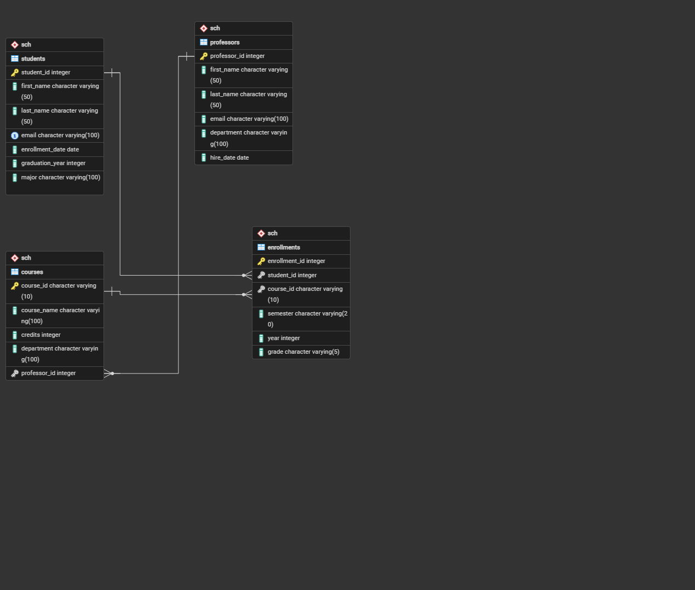

# MIS-443---Business-Data-Management
Assignment 4 - Individual PostgreSQL Database Project
# School Database Project - PostgreSQL & pgAdmin 4

> **Course:** MIS 443 - Business Data Management  
> **Institution:** Eastern International University (EIU)  
> **Student:** Đặng Huỳnh Quỳnh Như (IRN: 2032300287)  
> **Major:** Business Analytics  
> **Academic Term:** Quarter 4/2025-2026  

---

## Executive Summary

This project implements an end-to-end relational database system for a university environment using **PostgreSQL 16** and **pgAdmin 4**. The **School Database** centralizes core operational entities—**Students, Professors, Courses, and Enrollments**—enabling key academic departments (Registrar, Financial Aid, Curriculum Committee) to perform data auditing, monitor performance, and execute business queries efficiently.

---

## Database Architecture & Schema Design


                                    
### Key Entities & Entity Relationships
1. **`sch.students`**: Stores student profiles, enrollment dates, and graduation targets.
2. **`sch.professors`**: Manages faculty records, contact information, and departments.
3. **`sch.courses`**: Academic course offerings with credit allocations and assigned faculty.
4. **`sch.enrollments`**: Junction table establishing a **Many-to-Many (N:M)** relationship between Students and Courses.

* **Professors ➔ Courses (1:N):** One professor can teach multiple courses.
* **Students ➔ Enrollments (1:N):** One student can enroll in multiple courses.
* **Courses ➔ Enrollments (1:N):** One course can have multiple student enrollments.

---

### Table Descriptions & Relationships
1. **`sch.students`**: Stores student profiles, majors, enrollment dates, and expected graduation years.
2. **`sch.professors`**: Manages faculty records, departments, and hire dates.
3. **`sch.courses`**: Academic course catalog containing course codes, credit loads, and assigned professors.
4. **`sch.enrollments`**: Junction table establishing a **Many-to-Many (N:M)** relationship between Students and Courses, capturing semester, academic year, and grades.

* **Professors ➔ Courses (1:N):** One professor can teach multiple courses.
* **Students ➔ Enrollments (1:N):** One student can have multiple enrollment records.
* **Courses ➔ Enrollments (1:N):** One course can have multiple student enrollments.

---

## 📂 Repository File Structure

```text
├── courses.csv             # Sample dataset for courses
├── enrollments.csv         # Sample dataset for course enrollments
├── professors.csv        # Sample dataset for professors
├── students.csv           # Sample dataset for students
├── import data.sql           # DDL & Data Ingestion script (Table creation & Data cleaning)
├── exercise.sql              # DML Script (Solutions to business SQL questions 6.1 - 6.6)
├── Assignment 4 - danghuynhquynhnhu.pdf  # Final project report PDF
└── README.md                 # Project documentation
